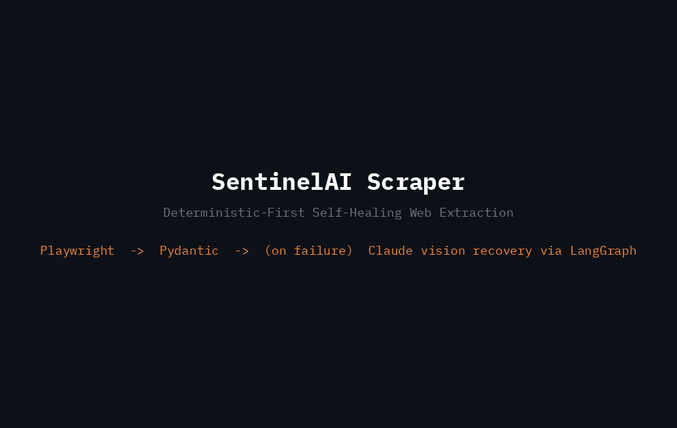
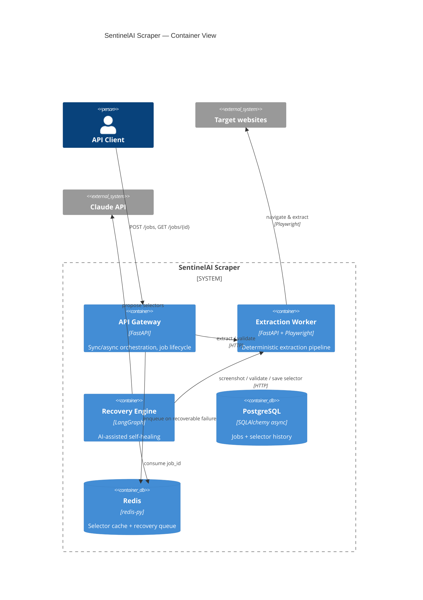

<div align="center">

<!-- Logo placeholder — swap this for a real SVG/PNG before publishing -->


# SentinelAI Scraper

**An autonomous, self-healing web data extraction platform — deterministic by default, AI-powered only when it needs to be.**

[](https://www.python.org/)
[](https://fastapi.tiangolo.com/)
[](https://github.com/langchain-ai/langgraph)
[](#testing)
[](#license)
[](#current-status--honest-limitations)
[](https://huggingface.co/spaces/Mozaar/sentinel_ai_scraper)

</div>

<div align="center">


<sub>Every line in this demo is real output from the actual system — a live API Gateway, a real Redis Streams queue, and the real Recovery Engine's `main.py` processing the job end-to-end.</sub>

**[Try it live on Hugging Face Spaces](https://huggingface.co/spaces/Mozaar/sentinel_ai_scraper)** — a simplified single-container version of this same system (real Playwright, real Redis Streams, real recovery loop). See [ADR-0017](docs/adr/0017-huggingface-space-simplified-deployment.md) for exactly what's simplified and why.
</div>

---

## Why this exists

Anyone who's run a scraper in production knows the real cost isn't writing it — it's the 2 a.m. Slack alert three weeks later because a site changed a `div` class and your pipeline has been silently returning empty rows since Tuesday.

Most teams solve this by either throwing more selectors at the problem (endless whack-a-mole) or throwing an LLM at *everything* (slow, expensive, and honestly overkill for a page that hasn't changed in months).

SentinelAI Scraper takes a third path: **do the boring, deterministic thing 99% of the time, and only call in the AI when something has genuinely broken.** Playwright does the extraction. Claude only shows up after a failure has been confirmed, and only to *propose* a fix — never to write anything to a database without a deterministic system checking its work first.

I built this as a hands-on exploration of production-grade AI agent architecture (LangGraph, self-healing pipelines, cost-aware AI escalation) — the kind of system design I work with daily running an AI automation practice. It's a real, working system, not a slide deck: three microservices, a shared domain kernel, 114 passing tests, and a full recovery loop you can watch happen end-to-end.

## What it actually does

1. You send a URL and the fields you expect (`title`, `price`, whatever).
2. Playwright navigates, extracts, and Pydantic validates the result. If everything checks out, you get your data back in the same request — no waiting.
3. If a field is missing (a selector broke), the system checks *whether AI can plausibly help* — a network error isn't something Claude can fix, so it won't even try. If the failure looks selector-related, the job goes into a recovery queue instead of just failing.
4. In the background, a LangGraph agent takes a screenshot, asks Claude to propose new selectors, and — critically — **tests that proposal live on the real page** before trusting it. If it works, the new selector gets saved and versioned. If it doesn't, it tries again (with the rejection reason in hand, so it doesn't repeat the same mistake) or, after a few attempts, gives up and flags the job for a human.
5. Either way, you poll `GET /jobs/{id}` and get a clear answer: success, still recovering, or "a person needs to look at this."

## Architecture, in one picture



Full C4 diagrams, sequence diagrams, and the LangGraph state machine live in [`docs/architecture/`](docs/architecture/). Every diagram there is drawn from the actual code — including a routing bug we found (and fixed) only once we ran the *compiled* graph, not just its individual nodes. That story's in the docs too, because I think "how we found the bug" is more useful than pretending it never happened.

## Key design decisions (and why)

I write an ADR for every decision that would need defending in a code review. There are 12 of them in [`docs/adr/`](docs/adr/) — here are the four that matter most:

- **Deterministic-first, always.** Claude is invoked only after a confirmed extraction failure, and its output is re-validated by Playwright and Pydantic before anything gets persisted. AI never writes to the database directly. → [ADR-0001](docs/adr/0001-deterministic-first-architecture.md)
- **Hybrid sync/async execution.** A clean extraction returns immediately (`200 OK`). A recovery-requiring one returns `202 Accepted` with a `job_id` — no arbitrary blocking on a process that might take 30 seconds. → [ADR-0003](docs/adr/0003-hybrid-sync-async-execution.md)
- **Not every failure deserves AI.** A missing selector is recoverable. A site that's simply down isn't — and burning Claude tokens trying to "fix" that would be a waste. There's a small policy object whose only job is telling those two cases apart.
- **A shared Postgres instance, on purpose.** Textbook microservices would say "one database per service." I chose a shared database for the `jobs` table and documented exactly why (and what I'd change at real scale) rather than pretending to follow the textbook while quietly ignoring it. → [ADR-0006](docs/adr/0006-shared-postgresql-database.md)

## Tech stack

| Layer | Choice | Why |
|---|---|---|
| Language | Python 3.12+ | Async-first ecosystem, strong typing with modern syntax |
| API | FastAPI | Native async, Pydantic integration, auto-generated OpenAPI |
| Browser automation | Playwright | Reliable headless Chromium, first-class async API |
| AI orchestration | LangGraph | State machine semantics fit a multi-step recovery loop better than a plain agent loop |
| AI recovery | Claude Computer Use | Visual reasoning for selector recovery (mocked during development, real activation is a deliberate, tracked step — see [Current Status](#current-status--honest-limitations)) |
| Persistence | PostgreSQL + SQLAlchemy (async) | Structured audit trail for jobs and selector history |
| Cache / queue | Redis | Selector cache (cache-aside) *and* the lightweight recovery queue |
| Testing | pytest + pytest-asyncio | 114 tests, unit + integration, real Redis/SQLite/Chromium where it matters |
| Metrics | Prometheus client | Every service exposes `/metrics`; see [`docs/observability/`](docs/observability/) |
| Quality | Ruff, MyPy (strict) | Zero warnings across the whole monorepo, checked constantly during development |

## Project structure

```
sentinelai-scraper/
├── libs/sentinel_shared/        # Shared domain contracts (enums, Job, validators) — nothing service-specific
├── services/
│   ├── api-gateway/              # Orchestration, job lifecycle, sync/async decision
│   ├── extraction-worker/        # Playwright, selector cache, deterministic pipeline
│   └── recovery-engine/          # LangGraph agent, Claude integration point
├── docs/
│   ├── adr/                      # 12 Architecture Decision Records
│   ├── architecture/              # C4 diagrams, sequence diagrams, LangGraph state diagram
│   ├── testing/                   # Testing strategy, measured coverage
│   └── observability/             # Metrics catalogue, Grafana dashboard layout
└── fixtures/demo-sites/           # Local HTML fixtures for fast, network-free tests
```

Each service follows the same internal shape — `domain/ → application/ → infrastructure/ → interfaces/` — so once you understand one, you understand all three. The domain layer never imports Playwright, Redis, or SQLAlchemy; that's what makes the 114 tests run in about a second without touching the network (aside from the handful of integration tests that intentionally do, against a real Redis and a real Chromium).

## Getting started

**Heads up:** Docker Compose isn't wired up yet (it's next on the list — see [Current Status](#current-status--honest-limitations)). For now, here's how to run things directly.

### Prerequisites
- Python 3.12+
- Redis running locally (`redis-server`)
- Chromium for Playwright (`playwright install chromium`)

### Run the tests

```bash
# From any service directory, e.g. services/extraction-worker
export PYTHONPATH=src:../../libs/sentinel_shared/src
pip install -r requirements.txt  # or the equivalent for your workflow
python -m pytest tests/ -v
```

Do this in each of `services/extraction-worker`, `services/api-gateway`, and `services/recovery-engine` — 114 tests, all green, in a few seconds total.

### Run it for real

```bash
# Terminal 1 — Extraction Worker
cd services/extraction-worker
export PYTHONPATH=src:../../libs/sentinel_shared/src
uvicorn extraction_worker.interfaces.http.app:create_app --factory --port 8001

# Terminal 2 — API Gateway
cd services/api-gateway
export PYTHONPATH=src:../../libs/sentinel_shared/src
export EXTRACTION_WORKER_BASE_URL=http://localhost:8001
uvicorn api_gateway.interfaces.http.app:create_app --factory --port 8000

# Terminal 3 — try it
curl -X POST http://localhost:8000/api/v1/jobs \
  -H "Content-Type: application/json" \
  -d '{"url": "https://books.toscrape.com/", "domain": "books.toscrape.com", "required_fields": ["title"]}'
```

## Testing

| Service | Tests | What's covered |
|---|---|---|
| Extraction Worker | 34 | Domain rules, use cases, real Playwright + Redis + SQLite integration |
| API Gateway | 33 | Orchestration policy, HTTP contract, rate limiting, real SQL + Redis Streams adapters |
| Recovery Engine | 58 | Every LangGraph node in isolation, the compiled graph end-to-end, Redis Streams crash/reclaim scenarios, Claude vision adapter |
| Shared kernel | 9 | Contracts consumed by all three services, tracing propagation |
| Contract tests | 6 | Real cross-service HTTP contracts (API Gateway ↔ Worker ↔ Recovery Engine), via in-process ASGI transport |
| **Total** | **140** | — |

Domain and application layers sit at 100% coverage. The honest gaps (and why they're gaps, not oversights) are written up in [`docs/testing/TESTING_STRATEGY.md`](docs/testing/TESTING_STRATEGY.md).

## Observability

Every service exposes `GET /metrics` in Prometheus format. The KPIs tracked map directly to the ones that actually matter for this kind of system — extraction success rate, recovery latency, selector cache hit rate, and (importantly) **cumulative AI cost**, because if that number starts climbing faster than your extraction volume, your "deterministic-first" system has quietly stopped being deterministic-first. Full catalogue and planned Grafana layout in [`docs/observability/OBSERVABILITY.md`](docs/observability/OBSERVABILITY.md).

## Current status & honest limitations

I'd rather tell you what's not done than let you find out the hard way:

- **Docker daemon runs, but image pulls don't.** Every Dockerfile and `docker-compose.yml` exist and were carefully reviewed, but this dev sandbox's network policy blocks Docker Hub — see [`docs/deployment/docker-guide.md`](docs/deployment/docker-guide.md) for the precise diagnosis.
- **No authentication yet.** Deliberate MVP decision with compensating controls — rate limiting is now implemented (Redis fixed-window, 60 req/min), and network binding is restricted (see [ADR-0009](docs/adr/0009-no-authentication-mvp.md)).
- **CI/CD is now in place.** GitHub Actions runs lint, strict type-check, and all 140 tests on every push, plus a dedicated workflow that actually builds and smoke-tests the full Docker Compose stack — the real Docker validation this dev sandbox couldn't perform locally.
- **The recovery queue's `reclaim_stale_messages()` isn't scheduled automatically** — it exists and is tested, but something (a cron, a periodic task) needs to call it after a crash for stale messages to actually be reclaimed.
- **Claude's real API pricing is hardcoded as an approximation** in `ClaudeVisionRecoveryEngine` — needs manual updates if Anthropic's pricing changes; documented in [ADR-0016](docs/adr/0016-claude-vision-not-computer-use.md).

What used to be on this list and isn't anymore: rate limiting, distributed tracing, contract tests between services, the Redis queue's message-loss risk, and Claude's mock-only status — all resolved with real, tested implementations (see ADRs 0014–0016).

None of this is hidden in the code — it's called out in the ADRs and docs at the exact point it becomes relevant.

## Roadmap

- [x] ~~Dockerize all three services + `docker-compose.yml`~~ — written and statically validated; real `docker build`/`up` now runs in CI (see `.github/workflows/docker-build.yml`) since this dev sandbox's network policy blocks Docker Hub
- [x] ~~GitHub Actions CI (lint, type-check, test on every push)~~ — done, plus a dedicated Docker smoke-test workflow
- [x] ~~Activate real Claude Computer Use behind the existing `RecoveryEnginePort`~~ — done via vision + structured output (see [ADR-0016](docs/adr/0016-claude-vision-not-computer-use.md))
- [x] ~~Contract tests between services~~ — done, `tests/contract/`
- [ ] API Key or OAuth2 authentication, replacing the current no-auth MVP posture
- [ ] Real OTLP exporter (Jaeger/Tempo) replacing the default console span exporter
- [ ] Scheduled `reclaim_stale_messages()` invocation for the Redis Streams recovery queue

See [ROADMAP.md](ROADMAP.md) for the full near/mid/long-term breakdown.

## Contributing

This started as a solo learning project, but if you spot something worth improving — a bug, an unclear doc, an architectural nitpick you disagree with — open an issue. I'd genuinely rather be told I'm wrong about a decision than have it sit undiscussed in an ADR forever.

## License

MIT. Use it, fork it, tear it apart to see how it works.

---

<div align="center">

Built as a deep dive into production-grade AI agent architecture — the same discipline I bring to building automation and AI agent systems day-to-day.

</div>
