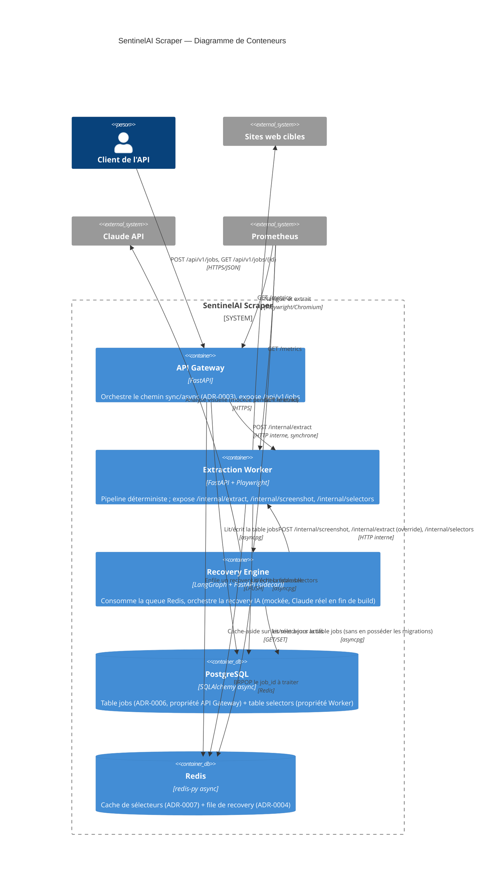

# C4 — Diagramme de Conteneurs

Vue détaillée des 3 microservices réellement implémentés, leur base de
données partagée (ADR-0006), et le mécanisme de file Redis (ADR-0004).

## Ce que ce diagramme révèle, en comparaison de l'esquisse théorique de la Phase 3

- **Le Recovery Engine ne touche jamais directement les sites cibles ni PostgreSQL en écriture sur `selectors`** — il passe systématiquement par le Worker, respectant strictement l'ADR-0002.
- **`recovery` a une frontière `FastAPI (sidecar)`** — pas pour du trafic métier, uniquement `/health` et `/metrics` (voir Phase 10), pendant que la vraie logique tourne dans une boucle de consommation en arrière-plan. C'est un détail d'implémentation qui aurait été facile à survoler, mais qui change concrètement comment ce service doit être déployé (Phase 12).
- **Trois flèches distinctes du Recovery Engine vers le Worker** — reflet exact des trois endpoints réellement construits au Cycle 13-15 (`/internal/screenshot`, `/internal/extract` avec override, `/internal/selectors`), pas un unique appel générique imaginé.
