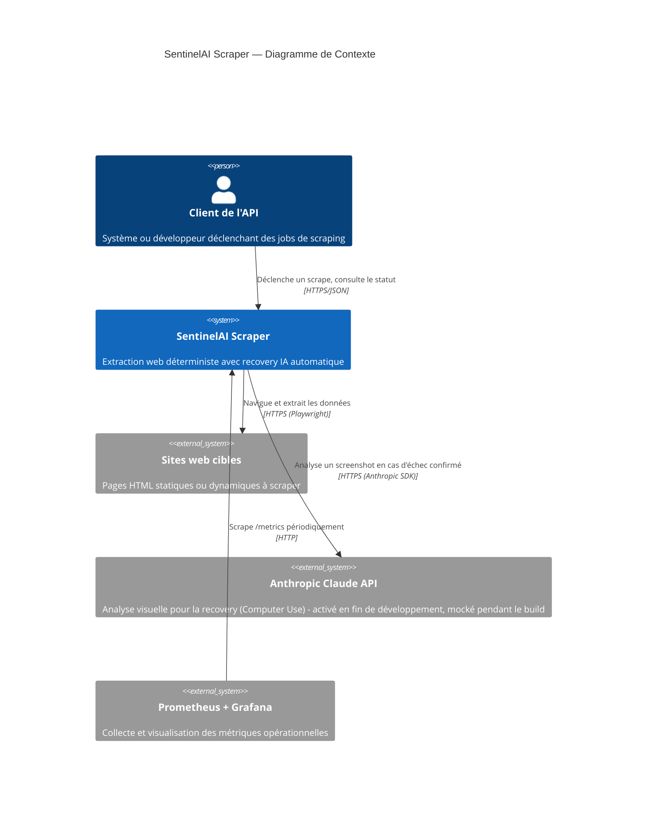

# C4 — Diagramme de Contexte

Vue la plus haute : SentinelAI Scraper comme boîte noire, ses utilisateurs
et les systèmes externes avec lesquels il interagit réellement.

## Ce que ce diagramme révèle

**Claude API n'est PAS au centre du système** — c'est un système externe
optionnel, appelé conditionnellement, exactement comme le sont les sites
cibles. Le mettre visuellement au même niveau que "Sites web cibles"
renforce le message de l'ADR-0001 (Deterministic-First) : l'IA est une
dépendance externe de secours, pas le cœur du produit.

**Un seul point d'entrée pour le client** — même si le système est composé
de 3 microservices en interne, le client de l'API n'en voit qu'un seul
(l'API Gateway). La complexité interne est un détail d'implémentation
invisible depuis ce niveau.
