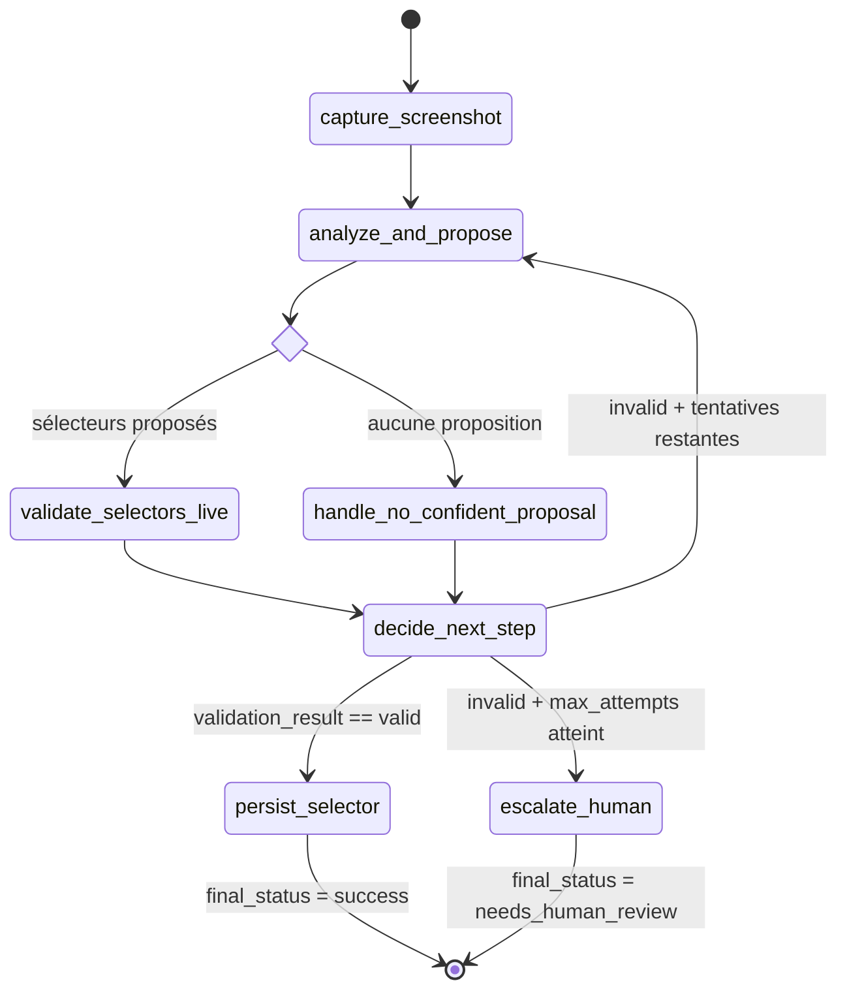

# Graphe LangGraph — Recovery Engine

Câblage réel de `build_recovery_graph()` (Cycle 15), incluant le nœud
correctif `handle_no_confident_proposal` découvert à l'assemblage du
graphe — absent de la conception initiale de la Phase 7, ajouté quand le
premier test d'intégration du graphe compilé a révélé le trou de routage.

## Le nœud qui n'était pas dans le plan initial

`handle_no_confident_proposal` n'apparaissait pas dans la conception de la
Phase 7 — le plan supposait implicitement qu'`analyze_and_propose` menait
toujours vers `validate_selectors_live`. Le premier test exécutant le
graphe **compilé** (`graph.ainvoke`, pas des nœuds isolés) a révélé qu'une
proposition non confiante ferait planter `validate_selectors_live` (qui
suppose des sélecteurs non-`None`). C'est un exemple concret de pourquoi un
test d'intégration du graphe complet est indispensable, même quand chaque
nœud est déjà parfaitement testé isolément — un bug de câblage est par
nature invisible aux tests unitaires de chaque brique.
