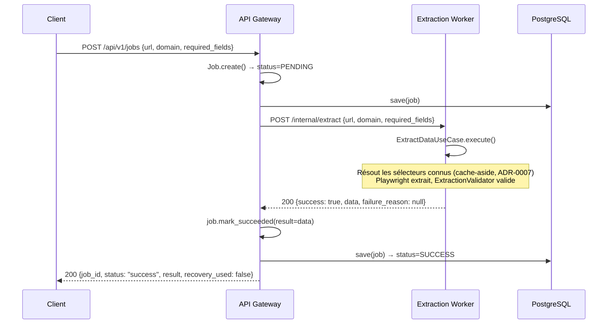
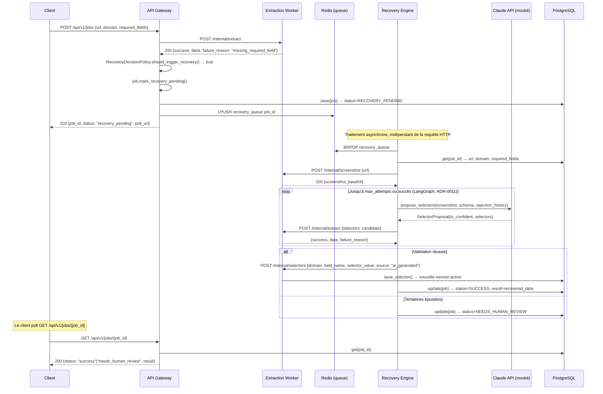

# Diagrammes de Séquence

Les deux flux d'exécution réellement implémentés (ADR-0003), avec les noms
d'endpoints et de composants exacts du code — pas une simplification.

## 1. Chemin nominal (synchrone) — extraction réussie du premier coup

## 2. Chemin de recovery (asynchrone) — échec réparable par IA

## Différences avec l'esquisse théorique de la Phase 3

- **Le screenshot transite en base64 dans le JSON** (ADR-0010), pas comme un chemin de fichier — détail qui n'existait pas dans la première esquisse et qui a émergé en construisant réellement le Cycle 13.
- **`/internal/extract` sert deux rôles** : résolution normale des sélecteurs connus (chemin nominal) ET validation de sélecteurs candidats via le paramètre optionnel `selectors` (chemin de recovery) — réutilisation délibérée d'un seul endpoint plutôt que duplication.
- **Le Recovery Engine met à jour `PostgreSQL` directement**, pas via un rappel HTTP vers l'API Gateway — reflet de l'ADR-0006 (base partagée) et du `SqlJobRepository` propre au Recovery Engine.
